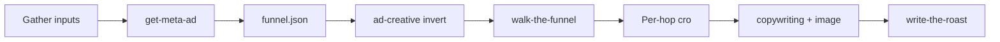

# Architecture Decision: Orchestrator Handoffs

## Requirements & Constraints

The decision is how `/start-the-roast` continues after intake: when the Playwright walk runs, how marketing skills attach to hops, and what the final report is.

Ranked quality attributes:

1. Sequence correctness — an agent following the skill does gather → Meta ad → walk → per-hop analysis → report, and does not stop after `funnel.json`.
2. Simplicity — skill/prose only; do not vendor a marketing suite or rebuild capture/score.
3. Pattern alignment — walker does not judge; disk is the handoff; product skills live under `skills/`; execution handoff, not restated sibling prose.
4. Maintainability — hop → skill mapping is one file; Corey's generators stay generators.

Technical constraints:

- `skills/get-meta-ad` already fetches the library into the roast workdir.
- `skills/walk-the-funnel` is a one-shot `HEADLESS=1 npm run capture` and writes `steps.json`.
- Corey Haines marketingskills are not in this repo. PRD uses them as rubric: invert `ad-creative`; `cro` for destination / on-site / checkout; `copywriting` + `image` for the LP mock.
- `npm run score` still uses the old eight-dimension letter grades. PRD replaced that with four buckets.
- Operator: no unit tests.

In scope: orchestrator wording, a hop → skill map, a report skill that assembles on-disk evidence.

Out of scope: agent-driven clicking, Marketing API, vendoring Corey's full skill tree, replacing the Playwright CLI, a public web app.

## Components

- `start-the-roast` — orchestrator. Numbered steps. Execution handoffs only.
- `get-meta-ad` — Ad Library → `ads.json` + media. Unchanged.
- `walk-the-funnel` — CLI walk → `steps.json` + screenshots. Unchanged. `--out` / `--run-id` point at the roast workdir.
- Hop analysis — after the walk, one invocation per `steps.json` hop plus the ad and the LP mock. Writes `<workdir>/analysis/<name>.md`.
- `write-the-roast` — reads funnel, ads, steps, analysis, artifacts; writes the report card in the workdir.

Communication is files, not chat. The walker process never loads a marketing skill.

## Options Evaluated

- **Interleaved hop agent**: Drive the browser one hop at a time and invoke a marketing skill after each click.
- **Vendor and score**: Vendor `ad-creative` / `cro` / `copywriting` / `image`, walk once, then call `npm run score` as the report.
- **One-shot walk, local hop map, report skill**: Walk via `/walk-the-funnel`, then apply a local hop → skill rubric map, then `/write-the-roast` assembles the PRD report card from disk.

## Analysis

| Criterion | Interleaved hop agent | Vendor and score | One-shot walk, local hop map, report skill |
| --- | --- | --- | --- |
| Fitness | Matches a literal "during the click" reading | Walks and names Corey's skills | Sequences all four operator steps; per-hop analysis is real |
| Alignment | Breaks walker-does-not-judge and "do not drive the browser" | Score CLI is the old rubric; vendored skills generate, they do not score | Matches disk handoff, invert-as-rubric, existing walk skill |
| Simplicity | New walker | Large third-party tree + unused score path | Two new prose files plus orchestrator edits |
| Maintainability | Two walkers to keep in sync | Upstream skill drift | One map file; Corey's repo stays a citation |
| Risk | High — different product | Medium — wrong report, heavy vendor | Low — reversible wording |

Key insights:

- "At each step" can mean "for each hop in `steps.json`" without interleaving clicks and judgment.
- Interleaving is not a second viable product. It is the live grading agent `systemPatterns.md` forbids.
- `npm run score` cannot be the final report. The PRD replaced its rubric.
- Vendoring Corey's skills copies generate-ads / optimize-this-page workflows we must invert. A local map states the invert.

## Decision

### Choice Pre-Mortem

- Operator wanted Corey's skill files on disk and invoked by those exact paths: checked — the map names those skills; local invert instructions are the closed stack so a roast does not depend on a GitHub fetch. Rework can vendor later without changing the sequence.
- Operator wanted a designed report-card product beyond agent-assembled HTML: checked — `write-the-roast` follows the PRD layout (ad cluster, journey cluster, four buckets, LP mock). A later taste pass can replace the HTML without changing the orchestrator.
- "At each step" required analysis mid-walk: checked — that reading violates walker-does-not-judge. Per-hop files after `steps.json` keep the sequence and the invariant.

**Selected**: One-shot walk, local hop map, report skill
**Rationale**: Sequence correctness and pattern alignment both win. The walk stays the CLI. Marketing skills run as rubric against artifacts. The report is a first-class handoff, not `report.json` from the old scorer.
**Tradeoff**: Analysis is not live during clicks. Corey's full skill text is not vendored.

## Implementation Notes

- Keep steps 1–5 of `start-the-roast` (inputs, workdir, schema, `get-meta-ad`, `funnel.json`).
- After `funnel.json`: invert `ad-creative` against the retrieved ad; write `analysis/creative.md`.
- Invoke `walk-the-funnel` with the funnel URL, `--out <workdir>`, and a fixed `--run-id` (for example `walk`) so `steps.json` lands in the roast directory.
- Read `references/hop-skills.md`. For each `steps.json` hop, invoke the mapped skill as rubric and write `analysis/<hop>.md`. After landing analysis, invoke `copywriting` + `image` for the v1 LP mock.
- Invoke `skills/write-the-roast`. Print the workdir and the report path. Remove "do not start any later pipeline step."
- Hop map (PRD):

| Artifact | Skill | Rubric mode | Output |
| --- | --- | --- | --- |
| Retrieved ad | `ad-creative` | Invert: hook, offer, visual, CTA | `analysis/creative.md` |
| `landing` | `cro` | Message match vs the ad | `analysis/landing.md` |
| `add_to_cart` | `cro` | On-site: value, CTA, hierarchy, proof | `analysis/add_to_cart.md` |
| `cart` | `cro` | On-site (cart is not its own bucket) | `analysis/cart.md` |
| `checkout` | `cro` | Friction, surprises, trust, field load | `analysis/checkout.md` |
| After landing | `copywriting` + `image` | Single-purpose LP that continues the primary ad | `analysis/lp-mock.md` and an image under `media/` when generated |

- Findings cite existing artifact paths only. Do not invent pages.
- Do not call `npm run score` from this orchestrator.
