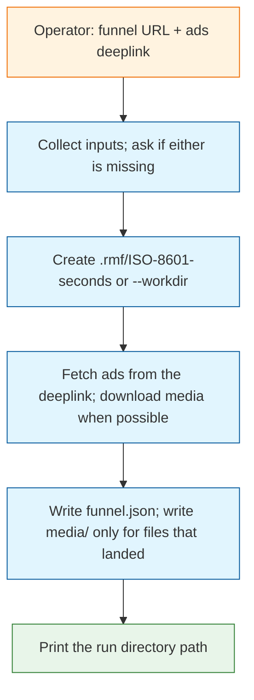

# Task: start-the-roast

* Task ID: start-the-roast
* Complexity: Level 3
* Type: feature

Entrypoint skill that collects a funnel URL and a Meta ads deeplink, writes a slobac-style timestamped run folder, and prints that folder's path. The folder holds `funnel.json` (funnel URL, ad spec, on-disk media paths when media was retrieved). Deliverable is prose: `SKILL.md` plus a schema reference. No unit tests, no retrieval library.

## Pinned Info

### Skill run flow

The skill is a single-agent workflow. Disk is the handoff; chat only prints the run directory.

## Component Analysis

### Affected Components
- `skills/start-the-roast`: does not exist → new product skill (workflow + schema reference). Lives under repo-root `skills/`, not imported `.cursor/skills/`.
- `.rmf/`: does not exist → local run-artifact parent, gitignored. Each run is `.rmf/<ISO-8601 seconds>/` unless `--workdir` is given.
- `.gitignore`: does not exist → ignore `.rmf/` so run folders are not committed.
- `README.md`: names the repo only → one short mention of the entrypoint skill.
- `memory-bank/productContext.md`: still describes a scaffolding-only repo → surgical update after the skill exists, because that sentence will be false.

### Cross-Module Dependencies
- Skill → run folder: the skill creates the directory and is the only writer of `funnel.json` and `media/`.
- Later roast steps → run folder: out of scope; they will read the printed path. This skill does not invoke them.
- Skill → schema reference: `SKILL.md` tells the agent to read `references/funnel-json.md` before writing the file.

### Boundary Changes
- New public contract: `funnel.json` shape in `skills/start-the-roast/references/funnel-json.md`.
- New invocation surface: `/start-the-roast` (skill name `start-the-roast`).
- No application APIs, packages, or plugins.

### Invariants
- Product skills live under `skills/`, not `.cursor/skills/`.
- Run folders persist on success and on partial retrieval; chat output is the directory path.
- `funnel.json` is the structured handoff. Media paths in it are relative to the run directory and appear only when the file exists on disk.
- A missing or blocked media download does not fail the run.
- This skill does not start later roast steps.
- No executable retrieval code and no test suite in this task.

## Open Questions

- [x] Unit tests / executable retrieval library → Resolved: operator, 2026-08-15: prose only, no unit tests.
- [x] Run-folder layout → Resolved: mirror slobac. Default `.rmf/<ISO-8601 seconds>/` in cwd (product name, same timestamp style as `.slobac/2026-05-12T18-30-45`). `--workdir` overrides. Writable-dir precondition. Media under `media/`.
- [x] How ads are retrieved → Resolved: the skill instructs the agent to open/fetch the deeplink and extract what it can. No Marketing API, no scraper package. Best-effort media.

## Test Plan (TDD)

### Behaviors to Verify

Operator constraint: no unit tests. These are the skill's observable behaviors for review, not automated cases.

- Missing input: invocation lacks funnel or ads deeplink → ask for the missing piece; do not create a run folder yet.
- Default workdir: both inputs present, no `--workdir` → create `.rmf/<timestamp>/` and write `funnel.json` there.
- Override workdir: `--workdir` given → use that path; create it if needed.
- Media retrieved: creative URL downloads → file under `media/`; `funnel.json` lists that relative path.
- Media not retrieved: download fails or no URL → ad still recorded; no fabricated `path`.
- Close: skill ends by printing the run directory path.

### Test Infrastructure

- Framework: none. Operator forbade a suite for this task.
- Test location: N/A
- Conventions: TDD carve-out for prose and policy artifacts (`.cursor/rules/shared/always-tdd.mdc`).
- New test files: none

### Integration Tests

- None in this task.

## Implementation Plan

1. [x] Ignore local run folders
    - Files: `.gitignore`
    - Tests first: N/A for prose & policy artifacts
    - Changes: add `.rmf/`
2. [x] Write the `funnel.json` contract
    - Files: `skills/start-the-roast/references/funnel-json.md`
    - Tests first: N/A for prose & policy artifacts
    - Changes: document required fields (`funnel.url`, `source.ads_deeplink`, `ads[]` with copy fields and optional `media[].path`), relative media paths, and the rule that `path` is omitted unless the file exists
3. [x] Write the entrypoint skill
    - Files: `skills/start-the-roast/SKILL.md`
    - Tests first: N/A for prose & policy artifacts
    - Changes: workflow skill (frontmatter per prompt-authoring). Steps: collect inputs, establish workdir (slobac rules), read the schema reference, fetch ads, write `funnel.json` and any media, print the directory. Author with `.cursor/skills/shared/prompt-authoring/SKILL.md`.
4. [x] Point the README at the skill
    - Files: `README.md`
    - Tests first: N/A for prose & policy artifacts
    - Changes: keep the title; add that `/start-the-roast` is the entrypoint and that runs land under `.rmf/`
5. [x] Correct product context
    - Files: `memory-bank/productContext.md`
    - Tests first: N/A for prose & policy artifacts
    - Changes: surgical replace of "scaffolding only" with the roast-entrypoint use case. Also correct the Key Constraints bullet "The README currently names the project and nothing else" — false once step 4 lands. Do not dump the task narrative.

## Technology Validation

No new technology - validation not required. No package, runtime, or test runner.

## Challenges & Mitigations

- Ads Library pages are JS-heavy; an agent fetch may get little or no media. Mitigation: best-effort; still write `funnel.json`; never invent paths.
- Deeplink shape is not specified (Ads Library vs Ads Manager). Mitigation: accept any URL; store it on `source.ads_deeplink`; extract what the page yields.
- Agents may write a free-form JSON blob. Mitigation: schema lives in `references/funnel-json.md`; the skill requires a read of that file before the write.
- Agents may add a Python helper or tests despite the constraint. Mitigation: skill and plan both say prose only.

## Pre-Mortem

- Inconsistent `funnel.json` across runs, so later steps cannot consume it: already covered by the schema-reference step and the "read before write" rule.
- Skill silently assumes Marketing API tokens the operator does not have: plan response is the retrieval decision — agent fetch only, no API client.
- Run artifacts get committed and leak ad creatives: already covered by gitignoring `.rmf/`.

## Preflight Findings

- **Fixed (completeness gap)**: Step 5 only named one of two `productContext.md` lines that step 4 (README edit) invalidates. Amended step 5 above to also cover the Key Constraints bullet about the README's current content.
- **Advisory (Radical Innovation, not applied)**: The Pre-Mortem already flags that Ads Library pages are JS-heavy and direct fetch may yield little media. Consider directing `SKILL.md` to fall back to a full-page screenshot of the deeplink as `media/` when direct download fails. Not applied here because it assumes the executing agent has screenshot/browser tooling, which is not guaranteed for every invocation context — operator should decide whether to add it as a documented best-effort fallback in `SKILL.md`.
- No TDD violations: every implementation unit is a prose/policy artifact (`.gitignore`, reference doc, `SKILL.md`, `README.md`, `productContext.md`) under the explicit skill/rule-wording carve-out in `.cursor/rules/shared/always-tdd.mdc`; the Test Plan schedules no automated or change-detector tests.
- No convention violations: `skills/<name>/SKILL.md` + `references/*.md` mirrors the layout already used by imported skills (e.g. `prompt-authoring/references/`); `.rmf/` as the run-parent name matches the product name (`README.md`: `rmf`), consistent with `.slobac/` in the cited reference project.
- No conflicts found: repo has no existing `.gitignore`, `skills/`, or `funnel.json`/`.rmf`/`start-the-roast` references outside the memory bank — nothing to duplicate or collide with (verified via repo-wide search).
- Dependency impact otherwise clean: no other files reference the touched paths; no other in-flight task in `memory-bank/active/`.
- All Project Brief requirements and acceptance criteria trace to a concrete plan step (1↔3, 2↔3, 3↔1+3, 4↔3, 5↔2+3; AC 1-5 ↔ steps 2-3).

## QA Findings

- **KISS**: Skill and reference docs are simple, direct, and concise without unnecessary abstractions or helper scaffolding.
- **DRY**: Clean separation between schema definition (`references/funnel-json.md`) and workflow steps (`SKILL.md`).
- **YAGNI**: No speculative features or unrequested dependencies/tests implemented.
- **Completeness**: All 5 Project Brief requirements, 5 acceptance criteria, and 5 implementation plan steps are completely implemented.
- **Regression**: Follows repository directory layouts (`skills/` vs `.cursor/skills/`), Slobac run folder patterns (`.rmf/`), and memory-bank conventions.
- **Integrity**: No hardcoded shortcuts, placeholders, or leftover debug stubs.
- **Documentation**: `README.md` and `memory-bank/productContext.md` accurately updated to describe the entrypoint skill and `.rmf/` run artifacts.

## Status

- [x] Component analysis complete
- [x] Open questions resolved
- [x] Test planning complete (TDD)
- [x] Implementation plan complete
- [x] Technology validation complete
- [x] Pre-Mortem complete
- [x] Preflight
- [x] Build
- [x] QA
