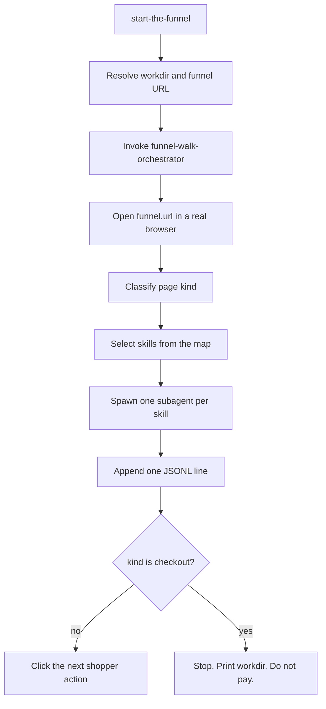

# Task: start-the-funnel

* Task ID: start-the-funnel
* Complexity: Level 3
* Type: feature

A product entrypoint (`/start-the-funnel`) that calls a walk orchestrator. The orchestrator instructs Grok to load a live funnel URL in a real browser, walk to checkout page-load, select marketingskills per hop, apply them in subagents, and append a JSONL of `skill : judgement` for each page.

## Pinned Info

### Walk and judge loop

Parent walks and classifies. Subagents judge. Disk is the handoff. This diagram is the control flow the two skills must share.

## Component Analysis

### Affected Components
- `skills/start-the-roast`: writes `.rmf/<timestamp>/funnel.json` and prints the path. Does not start later steps. **No behavior change.** `start-the-funnel` consumes that path.
- `skills/start-the-funnel` (new): entrypoint. Resolves workdir + funnel URL, then invokes the orchestrator.
- `skills/funnel-walk-orchestrator` (new): walk loop, skill selection, subagent judgements, JSONL append.
- Playwright `src/capture/*`: live CLI walker. **Unchanged.** This task is a parallel agent path for when Playwright cannot be used.
- Offline `src/score/*`: Grok-on-bundle scorer. **Unchanged.** The JSONL is a new artifact, not a replacement for `report.json`.
- `README.md`: add a short "Walk the funnel" section.
- `memory-bank/systemPatterns.md`: surgical note that the agent-walk path exists and that judgements live in `walk.jsonl`.
- `memory-bank/productContext.md`: surgical note that a Grok-driven walk is a capture path when Playwright cannot run.

### Cross-Module Dependencies
- `start-the-funnel` → `funnel-walk-orchestrator`: execution handoff. Entrypoint does not contain the walk loop.
- `funnel-walk-orchestrator` → `funnel.json` (optional): reads `funnel.url` and `ads[]` when the workdir came from `/start-the-roast`.
- `funnel-walk-orchestrator` → marketingskills (GitHub raw): each judge subagent fetches the named skill's `SKILL.md` before judging.
- `funnel-walk-orchestrator` → `walk.jsonl`: append-only, one object per hop.

### Boundary Changes
- New on-disk contract: `<workdir>/walk.jsonl` (schema in `skills/funnel-walk-orchestrator/references/walk-jsonl.md`).
- New page-kind vocabulary: `destination` | `product` | `cart` | `checkout` | `blocker` | `other`.
- New skill allowlist (not the full marketingskills catalog): `cro`, `ad-creative`, `popups`, `signup`, `offers`.
- Playwright capture CLI and `bundle.json` / `report.json` stay as they are.

### Invariants
- Checkout is page-load only. No email, address, phone, or card. Do not submit payment. Do not invent a card.
- The walker (parent agent) does not write judgements. Subagents do.
- A JSONL `screenshot` path is present only when that file exists on disk.
- Do not invent pages, CTAs, or judgements for a hop that was not opened.
- Reaching a payment-complete or thank-you page is a walk failure.
- Product skills live under `skills/`.
- This path does not call `npm run capture`.

## Open Questions

None — implementation approach is clear.

Resolved in this plan without a creative loop (start-the-roast pattern + operator spec + PRD skill mapping):

- Two skills, not one: entrypoint calls orchestrator.
- Prose skills, not TypeScript. No new test runner. TDD carve-out for prose and policy.
- Skill texts are fetched from pinned GitHub raw URLs at judgement time. They are not vendored.
- `/start-the-roast` is not modified to auto-continue.
- Playwright CLI is left in place. This is a second walker.

## Test Plan (TDD)

### Behaviors to Verify

All deliverables are product skills and schema/reference prose. There is no new executable behavior in this task.

- Entrypoint present: operator invokes `/start-the-funnel` → skill loads and hands off to the orchestrator.
- Orchestrator walk: given a funnel URL → instructions to open a real browser and walk to checkout page-load.
- Skill selection: given a page kind (+ ads / overlay / account-wall signals) → a closed set from the map.
- Subagent judge: selected skill → one judgement string recorded as `skill` + `judge`.
- JSONL: each hop → one line in `walk.jsonl` when checkout is reached.

### Edge Cases

- Missing URL and missing `funnel.json` → stop. Do not walk.
- Unwritable workdir → stop.
- Bot / captcha / login-before-cart → `kind: blocker`, record the line, stop. Do not invent a checkout.
- Skill fetch fails → write `error` on that judgement. Do not invent a judge string.
- Overlay present → include `popups`. Overlay absent → do not.
- Ads present in `funnel.json` on destination → include `ad-creative` (invert: score the existing ad). Ads absent → do not.
- Account wall at checkout → include `signup`. Do not log in.
- Thank-you / paid URL → fail the walk.

### Test Infrastructure

- Framework: none in `package.json` (same as `/start-the-roast`).
- Test location: none.
- Conventions: prose product skills under `skills/`; run folders under `.rmf/`.
- New test files: none.

### Integration Tests

- None. A live walk is an operator/agent run, not a CI test.

## Implementation Plan

1. [x] JSONL schema reference
    - Files: `skills/funnel-walk-orchestrator/references/walk-jsonl.md`
    - Tests first: N/A for prose & policy artifacts
    - Changes: one-object-per-line schema. Required keys: `step` (1-based int), `kind`, `url`, `judgements` (array of `{skill, judge}` or `{skill, error}`). Optional: `screenshot` (relative path, only if the file exists), `signals` (`overlay`, `account_wall`, `priced_offer`, `ads_present`). No extra top-level keys. Include at least one full example line (mirror `funnel-json.md`).

2. [x] Skill selection map
    - Files: `skills/funnel-walk-orchestrator/references/skill-map.md`
    - Tests first: N/A for prose & policy artifacts
    - Changes: closed allowlist and fetch URLs on `coreyhaines31/marketingskills` `main`:
        - `cro` — every `destination`, `product`, `cart`, `checkout` hop
        - `ad-creative` — `destination` only, and only when `funnel.json` has a non-empty `ads` array. Invert: judge the existing ad (hook, offer, visual, CTA), do not generate ads
        - `popups` — any hop where an overlay/modal/cookie/email gate is visible
        - `offers` — `product` or `cart` when a priced package, membership, or stacked line-item offer is visible
        - `signup` — `checkout` when an account-creation wall is visible
        - `blocker` / `other` — no skills. Record the hop. Do not invent judgements
      Subagent instruction: fetch the skill, apply it as a judge on the current page evidence, return one short judgement. Do not interview. Do not rewrite the page.

3. [x] Orchestrator skill
    - Files: `skills/funnel-walk-orchestrator/SKILL.md`
    - Tests first: N/A for prose & policy artifacts
    - Changes: numbered walk loop. Read both reference files before walking. Open `funnel.url` in a real browser (Cursor browser, computer-use, or the operator's desktop Chrome). Do not launch Playwright / `npm run capture`. Shopper path: destination → product if needed → add to cart → cart → checkout page-load. At each hop: dismiss or note overlays, screenshot into `artifacts/`, classify `kind`, select skills, spawn one subagent per skill with the screenshot + visible copy + URL + ads context, join, append one JSONL line, then click the next intent. Stop on checkout page-load, on `blocker`, after 8 hops, or if a thank-you/paid page appears (failure). Print the workdir. Do not paste the JSONL into chat.

4. [x] Entrypoint skill
    - Files: `skills/start-the-funnel/SKILL.md`
    - Tests first: N/A for prose & policy artifacts
    - Changes: resolve workdir and funnel URL, then invoke `funnel-walk-orchestrator`. Do not walk inside this skill. Do not roast in chat.
        - **Workdir:** if `--workdir <path>` is present, use it (create if missing). Otherwise create `.rmf/<timestamp>/` in the operator's cwd (same UTC timestamp format as `/start-the-roast`; create `.rmf/` if needed).
        - **Writable check:** same touch-and-delete probe as `/start-the-roast` Step 2; stop on failure.
        - **Funnel URL:** from invocation, else `funnel.json`'s `funnel.url` when the workdir already has one. If still missing, stop. Do not walk.

5. [x] README
    - Files: `README.md`
    - Tests first: N/A for prose & policy artifacts
    - Changes: short "Walk the funnel" section pointing at `/start-the-funnel` and `walk.jsonl`.

6. [x] Persistent memory-bank reconciliation
    - Files: `memory-bank/systemPatterns.md`, `memory-bank/productContext.md`
    - Tests first: N/A for prose & policy artifacts
    - Changes: surgical. Record the agent-walk path as a **second capture path** (when Playwright cannot run), the parent-walks / subagent-judges split, and `walk.jsonl` as the step-judgement handoff. Leave the Playwright walk + offline Grok-on-bundle score path intact and still described.

## Technology Validation

No new technology — validation not required. No new npm packages. No test runner. Marketingskills are fetched at judgement time from GitHub raw URLs already named in the skill map.

## Challenges & Mitigations

- Agent has no browser in this environment: the skills are the instructions; the walk runs where Grok can drive a real browser. The skill must say that, and must not fall back to Playwright.
- Marketingskills fetch fails or the skill text changes on `main`: record `error` on that judgement; do not invent a judge. Pin skill *names* and raw paths, not a distilled rewrite of Corey's prose.
- Subagents generate ads or rewrite copy instead of judging: the map and the subagent prompt say invert / judge only, return one string.
- Parent agent grades while clicking: both skills state the walker does not write judgements.
- Infinite click loop on a SPA: hard cap of 8 hops; `blocker` stops the walk.
- Agent fills checkout fields: stop-before-PII is restated on the classify, click, and checkout steps.
- `systemPatterns.md` still says walker and judge never mix: this path keeps the split as parent-walks / subagents-judge, and leaves Playwright + offline `score` in place.

## Pre-Mortem

- Built a Playwright/TypeScript walker instead of Grok instructions: already covered by Challenge 1 and Implementation steps 3–4 (prose skills only).
- Selected from all 50 marketingskills: already covered by the closed allowlist in step 2.
- JSONL is an un-auditable chat log (no kind, no URL, no screenshot): schema in step 1 requires `kind`, `url`, and optional `screenshot` only when the file exists.
- `/start-the-roast` was chained and now walks automatically: step 4 consumes a path; roast skill is not edited.
- Change-detector tests were added against skill wording: no tests are planned.

## Status

- [x] Component analysis complete
- [x] Open questions resolved
- [x] Test planning complete (TDD)
- [x] Implementation plan complete
- [x] Technology validation complete
- [x] Pre-Mortem complete
- [x] Preflight
- [x] Build
- [ ] QA
