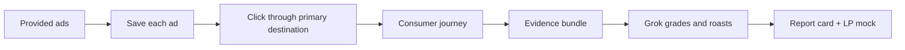

# System Patterns

Definitional architecture for Roast My Funnel. Pipeline, score buckets, write-up layout, and keep-vs-change are specified in [`prd.md`](../prd.md). This file is the briefing you need before touching the system; it does not duplicate the spec. Reconciliation turns these contracts from aspirational to descriptive as they land in code.

## How This System Works

The product is a **background pipeline** plus a **report card**. The operator does not watch a mouse. Playwright walks and captures. **Grok judges.** Those roles do not mix.

Ads are inputs, not discoveries. Shared destinations are walked **once**. The journey is one shopper path: destination → product if needed → cart → checkout page load. Stop before PII or payment.

Scoring is four weighted buckets (creative / message match / on-site / checkout) that roll into one 0–100 Funnel Score. Cart is on-site, not its own bucket. Corey Haines [marketingskills](https://github.com/coreyhaines31/marketingskills) is the **rubric brain**, not an interview. Message-match logic for a paid funnel lives in this product; that skill does not ship it.

The write-up is the product: a visual canvas (ad cluster, journey cluster, roast on the tiles, score, v1 LP still). Capture remains a CLI / agent run (`capture` then `score` / report).

Violating the walker/judge split, the stop-before-payment guard, or “Grok works only from the bundle” produces a different product — a live browser agent that grades as it clicks, or a scorer that invents pages it never saw.

## Walker does not judge

Playwright records pages, frames, copy, and artifacts. It does not assign scores. Grok reads the evidence bundle offline and does not browse. An AI helper used only to **find a button** after heuristics fail is not a judge — see `ActionLayer` in `src/types.ts`.

## Evidence bundle is the only fact base

Scoring treats the bundle and its screenshots as the only facts. Findings must cite artifacts that exist. Do not invent pages, CTAs, or errors that are not in the evidence.

## A hop that is not the page is a walk failure

A 0-exit CLI and a `steps.json` on disk are not a successful walk. If a hop screenshot is a bot wall, challenge, interstitial, blank chrome, or leftover previous page, the walk failed. The roast agent may recover or bail. Telling the operator that analysis cannot be completed is better than judging the wrong page. Detecting “this is not the page” is capture integrity, not a CRO score.

## Stop before payment

Checkout is page-load only. No email, address, phone, or card. Do not submit payment. Do not invent a card. Reaching a payment-complete or thank-you page is a capture failure.

## Shared pages are unique

If two ads hit the same URL, walk and grade that page once. Ads point at the shared tile. PDP, cart, and checkout are each graded once per run.

## Model pin is grading policy

The scoring model identity is a product contract, not a convenience default. Changing it is a grading-policy change. The pin lives with the scorer (`PINNED_MODEL` in `src/score/grades.ts`).

## Product skills live under `skills/`

Imported instructions stay in `.cursor/`. The walk entrypoint is `skills/walk-the-funnel`. The roast entrypoint is `skills/start-the-roast`; it sequences gather → `get-meta-ad` → walk → per-hop analysis → `write-the-roast`. Meta Ad Library retrieval is `skills/get-meta-ad`; the entrypoint invokes it and does not fetch the library itself. The report entrypoint is `skills/write-the-roast`. Do not put product skills under `.cursor/skills/`.

## Entrypoint runs land under `.rmf/`

`/walk-the-funnel` writes under `runs/<id>/` when invoked alone (gitignored). When `/start-the-roast` invokes it, the walk lands at `<workdir>/walk/` via `--out` and `--run-id walk`. `steps.json` is the hop-list handoff; `bundle.json` stays on disk. `/start-the-roast` writes a timestamped directory under `.rmf/` (gitignored), or an explicit `--workdir`. That directory holds `funnel.json`, `analysis/`, walk artifacts, and `report.html`.
