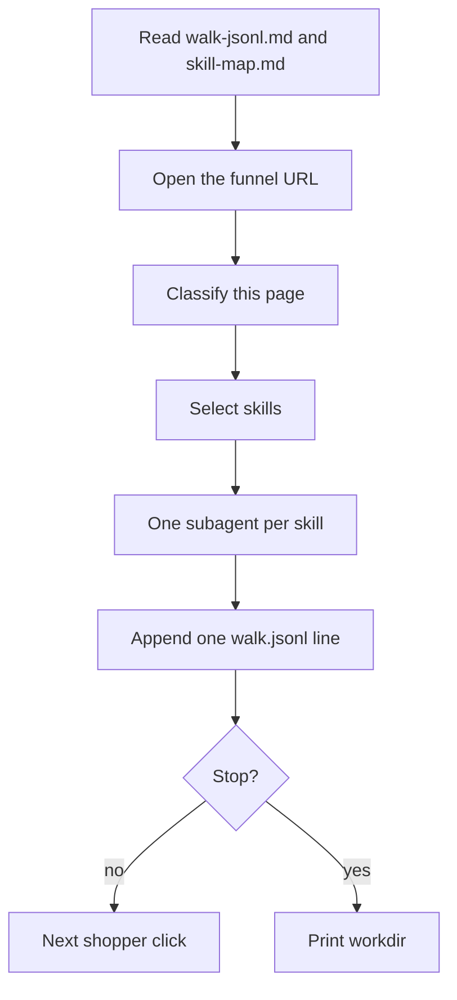

# Funnel Walk Orchestrator

Parent walks and classifies. Subagents judge. Disk is the handoff. Chat output is the run directory path.

This skill runs where a real browser can be driven (Cursor browser, computer-use, or the operator's desktop Chrome). If no real browser is available, **stop**. Name that. Do not launch Playwright. Do not run `npm run capture`.

## Step 1 — Read the references

Read [`references/walk-jsonl.md`](references/walk-jsonl.md) and [`references/skill-map.md`](references/skill-map.md). Do not walk until both reads are done.

## Step 2 — Resolve the URL

Need a writable workdir (from the caller) and an absolute HTTP(S) funnel URL.

1. If `<workdir>/funnel.json` exists, use its `funnel.url`. Use its `ads` array for `ads_present`.
2. Else use the URL the caller passed.
3. If still missing, **stop**. Do not open a browser.

## Step 3 — Open the site

Open the funnel URL in a real browser. Wait until the first page is usable.

Do not submit payment. Do not invent a card. Do not type email, address, or phone.

## Step 4 — Hop loop

Repeat this loop. `step` starts at 1. Stop when any halt in Step 5 is true.

### 4a — Note the page

Dismiss or note overlays. Record `overlay` when an overlay, modal, cookie gate, or email gate is visible.

Screenshot the viewport into `<workdir>/artifacts/<NN>-<kind>.png` (`NN` is `step` padded to two digits). Create `artifacts/` when the first file lands. Confirm the file exists before writing `screenshot` later.

### 4b — Classify `kind`

Use the URL and what is on screen:

| `kind` | When |
| --- | --- |
| `checkout` | Path matches `/checkouts?` or a payment form is visible. |
| `cart` | Path matches `/cart` or cart chrome is the page. |
| `product` | Path matches `/products?/` or a single product with add-to-cart is the page. |
| `destination` | `step` is 1 and the page is not cart or checkout. |
| `blocker` | Captcha, bot wall, or a login wall **before** cart. |
| `other` | None of the above. |

If the URL or visible copy is a payment-complete or thank-you page, the walk has **failed**. Stop. Do not append a success checkout line.

On `checkout`: do not type into fields. Do not create an account. Record `account_wall` when account creation is required to continue.

On `product` or `cart`: record `priced_offer` when a priced package, membership, or stacked line-item offer is visible.

### 4c — Select and judge

Select skills from the skill map using `kind` and the signals from 4a–4b.

Spawn **one subagent per selected skill**. The walker does not write judgements.

Each subagent follows the subagent contract in the skill map. Join them before 4d.

`blocker` and `other`: skip subagents. `judgements` is `[]`.

### 4d — Append one line

Append one object to `<workdir>/walk.jsonl` using the schema from Step 1.

- `screenshot` only after the file exists.
- `signals` only for flags that are true on this hop.
- Each judgement is `{skill, judge}` or `{skill, error}`.

Do not invent pages, CTAs, or judgements for a hop that was not opened.

### 4e — Next click

If Step 5 says stop, skip this click.

Otherwise click the next shopper action. Do not submit payment. Do not invent a card. Do not type email, address, or phone.

| Current `kind` | Next action |
| --- | --- |
| `destination` or `other` | Open a product that can be added to the cart. |
| `product` | Add to cart. |
| `cart` | Open checkout. |
| `checkout` | Do not click. |
| `blocker` | Do not click. |

Then increment `step` and go to 4a.

## Step 5 — Halts

Stop the loop when any of these is true:

1. `kind` is `checkout` and the line for that hop is written.
2. `kind` is `blocker` and the line for that hop is written.
3. `step` would exceed 8.
4. The page is payment-complete or thank-you (failure).

Login walls before cart are `blocker`. Account walls at checkout are in scope: screenshot, judge, do not log in.

## Step 6 — Print the run directory

Print the absolute path of the workdir. That path is the deliverable.

Do not paste `walk.jsonl` into chat. Do not roast the funnel in chat. Do not start a later pipeline step.
