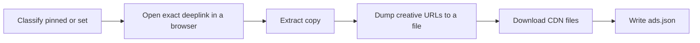

# Get Meta Ad

Single-agent workflow. Disk is the handoff. Chat output is the `ads.json` path.

Do not call the Meta Marketing API or the Graph API. Do not add a scraper package or helper script. Do not invent ads, copy, or media paths.



## Step 1 — Collect inputs

Resolve two values from the invocation:

1. **Ads deeplink** — an absolute HTTP(S) URL to Meta or Facebook ads.
2. **Workdir** — an existing directory, or `--workdir <path>`. If none is given, create `.rmf/<timestamp>/` in the current working directory (`<timestamp>` is UTC at seconds precision with colons replaced by hyphens). Create `.rmf/` if it does not exist.

If the deeplink is missing or is not an absolute HTTP(S) URL, ask for it and **stop**. Do not fetch ads.

Create a small file in the workdir and delete it. If that write fails, **stop**. Name the path and the failure reason.

## Step 2 — Classify the deeplink

Parse the ads deeplink. If it has a non-empty `id` query parameter, the run is **pinned** to that id. Otherwise the run is a **set**. `view_all_page_id` and search URLs without `id` are sets.

## Step 3 — Open the library

**Skip HTTP fetch of the Ad Library page.** `facebook.com/ads/library` answers with a 403 JavaScript challenge or a timeout. Do not spend a turn on curl or an HTTP fetch of that HTML.

Open the exact deeplink in a browser (or a browser subagent).

### Pinned

Stay on that URL. Do not click other library cards, "See more ads", advertiser pages, or search results. Any helper you spawn must be told the target id and this stay-on-URL rule.

If the matching ad is not on the page, extract nothing. Do not substitute a sibling, related, or advertiser-page ad.

### Set

Extract every ad the page yields. Do not leave the page to hunt more ads.

### No browser

If no browser is available, one HTTP GET of the exact deeplink is allowed. Treat a challenge page or empty body as no ads. Do not retry with scrapers.

## Step 4 — Extract copy

From the Ad Details view when it is available, otherwise from the visible card, take only values that are on the page:

- `id` — Library ID
- `permalink` — the address-bar URL when that is the ad's URL
- `advertiser` — Page name
- `body` — primary text
- `headline`
- `description` — link or extra description
- `cta` — button label

A pinned run keeps only the ad whose platform id equals the `id` query value.

If the details say the ad has multiple versions, take the currently visible version. Do not click through versions unless you need every creative for that same id.

## Step 5 — Dump creative URLs to a file

Chat truncates `fbcdn.net` URLs. Write the full strings to a file on disk before you leave the page (for example `<workdir>/creative-urls.txt`).

In the page's DevTools console, collect:

- every `video` `src` / `currentSrc`
- every `video` `poster`
- every large creative `img` `src` (skip logos and chrome icons)

A snippet that works:

```js
document.querySelectorAll("video").forEach((v) => console.log(v.src || v.currentSrc, v.poster));
```

Do not invent URLs. Only write strings you read from the DOM.

## Step 6 — Download creatives

Library HTML is blocked. The CDN files usually are not.

For each creative URL, download with an ordinary HTTP client using a desktop Chrome `User-Agent` and `Referer: https://www.facebook.com/ads/library/`. Name files `media/<ad-id>-<index>.<ext>` using the ad id when known, a zero-based index, and an extension from the URL or `Content-Type`. Create `media/` only when at least one file lands.

Keep a file only when its MIME type is `video/*` or `image/*`. Discard HTML challenge bodies.

A failed download does not fail the run. Continue with whatever landed.

Do not write a `path` for a file that is not on disk.

## Step 7 — Write ads.json

Read [`references/ads-json.md`](references/ads-json.md). Do not write `ads.json` until this read is done.

Write `<workdir>/ads.json`:

- `source.ads_deeplink` is the deeplink from Step 1, stored as given.
- `ads` is the extracted list. Use `[]` when nothing was extracted. A pinned deeplink yields at most one ad.
- For each media object, include `path` only after confirming that file exists under the workdir. Omit `path` when the file is missing.

Do not write `funnel.json`.

## Step 8 — Print the ads.json path

Print the absolute path of `<workdir>/ads.json`. That path is the deliverable.

Do not paste `ads.json` into chat. Do not roast, rewrite, or critique the ads.
