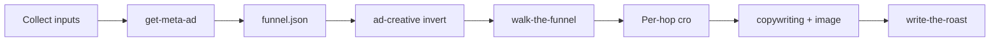

# Start the Roast

Single-agent workflow. Disk is the handoff. Chat output is the workdir path and the report path.

The chart is the map. The steps below are the driving instructions.

## Step 1 — Collect inputs

Resolve two values from the invocation:

1. **Funnel** — an absolute HTTP(S) URL for the landing page or offer.
2. **Ads deeplink** — an absolute HTTP(S) URL to Meta or Facebook ads. A library URL with a non-empty `id` query parameter is one ad. A URL without `id` is a set.

If either value is missing or is not an absolute HTTP(S) URL, ask for the missing piece and **stop**. Do not create a run directory. Do not fetch ads. Do not walk. Do not write a report.

## Step 2 — Establish workdir

Create the run directory. It persists if later steps only retrieve part of the ads.

### Default path

`.rmf/<timestamp>/` in the operator's current working directory. `<timestamp>` is UTC at seconds precision with colons replaced by hyphens so the name is one path segment (example: `2026-05-12T18-30-45`). Create `.rmf/` if it does not exist.

### Override

If the invocation includes `--workdir <path>`, use that path instead of the default. Create it if it does not exist.

### Writable check

Create a small file in the workdir and delete it. If that write fails, **stop**. Name the path and the failure reason. Do not continue without a writable workdir.

## Step 3 — Read the schema

Read [`references/funnel-json.md`](references/funnel-json.md). That file is the shape of `funnel.json`. Do not write `funnel.json` until this read is done.

## Step 4 — Fetch ads

Invoke [`../get-meta-ad/SKILL.md`](../get-meta-ad/SKILL.md) with:

1. The ads deeplink from Step 1
2. The workdir from Step 2

Do not open, fetch, or parse the Ad Library yourself. That skill writes `<workdir>/ads.json` and any media files.

When it finishes, continue to Step 5. A missing `ads.json` or an empty `ads` array is not a failure.

## Step 5 — Write funnel.json

Write `<workdir>/funnel.json` to the schema from Step 3.

- `funnel.url` is the funnel from Step 1.
- `source.ads_deeplink` is the deeplink from Step 1, stored as given.
- `ads` is the `ads` array from `<workdir>/ads.json`. Use `[]` when that file is missing or `ads` is empty.
- For each media object, include `path` only after confirming that file exists under the workdir. Omit `path` when the file is missing.

Do not invent ads, copy, or media paths.

When `funnel.json` is on disk, continue to Step 6.

## Step 6 — Invert ad creative

Read [`references/hop-skills.md`](references/hop-skills.md). Do not write any `analysis/` file until this read is done.

Apply the retrieved-ad row. Write `<workdir>/analysis/creative.md`.

If `ads` is empty, write the miss. Do not invent an ad. Continue to Step 7 either way.

Do not browse. Do not call `npm run score`.

## Step 7 — Walk the funnel

Invoke [`../walk-the-funnel/SKILL.md`](../walk-the-funnel/SKILL.md) with:

1. The funnel URL from Step 1
2. `--out <workdir>`
3. `--run-id walk`

Do not drive the browser yourself. Do not type email, address, or card data. Do not submit payment.

If the walk fails, print the error and **stop**. Do not invent hops. Do not write hop analysis. Do not write a report.

When it finishes, read `<workdir>/walk/steps.json` from disk. Do not use chat paste as the hop list.

If `steps.json` is missing, **stop**. Name the missing path.

When `steps.json` is on disk, continue to Step 8.

## Step 8 — Analyze each hop

Read [`references/hop-skills.md`](references/hop-skills.md) if that read is not already done.

For each hop in `walk/steps.json`, apply the mapped row and write `<workdir>/analysis/<hop>.md`.

Cite workdir-relative artifact paths (`walk/artifacts/…`). Do not invent pages. Do not browse. Do not drive the browser. Do not call `npm run score`.

When every hop in `steps.json` has an analysis file, continue to Step 9.

## Step 9 — Draft the LP mock

Apply the after-landing row from `hop-skills.md`. Write `<workdir>/analysis/lp-mock.md`. Write `<workdir>/media/lp-mock.png` only when an image file actually lands.

A missing image is not a failure. Continue to Step 10.

## Step 10 — Write the report

Invoke [`../write-the-roast/SKILL.md`](../write-the-roast/SKILL.md) with the workdir from Step 2.

Do not assemble the report yourself. Do not call `npm run score`.

When it finishes, continue to Step 11. If `<workdir>/report.html` is missing, **stop**. Name the missing path.

## Step 11 — Print the paths

Print:

1. The absolute path of the workdir
2. The absolute path of `<workdir>/report.html`

Those two paths are the deliverable.

Do not paste `funnel.json`, `steps.json`, or `report.html` into chat.
